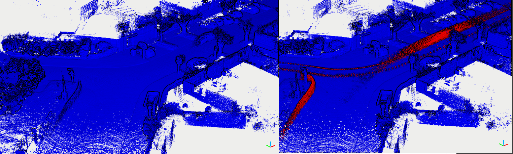

Removert
---

This is no ros version! Origin one please check fork repo.

pcd files are enough to run this program. Need transformed and pose in VIEWPOINT. 

Please reference our [DynamicMap benchmark](https://github.com/KTH-RPL/DynamicMap_Benchmark) for more detail on datasets.

## Build & RUN
```bash
mkdir build && cd build
cmake .. && make
./removert_run /home/kin/data/00 ../config/params_kitti.yaml -1
```
- `-1` means all frames in the pcd folder, default is only 1 frame.


You can use pcl_view to compare with gt under `/home/kin/data/00`, like this:
```
pcl_viewer -multiview 1 gt_cloud.pcd removert_output.pcd
```
Or in CloudCompare:


Dependencies:
1. OpenCV
    For ubuntu 20.04 may occur this error:
    ```bash
    fatal error: opencv2/cv.h: No such file or directory
    ```
    ln from opencv4 to opencv2
    ```bash
    sudo ln -s /usr/include/opencv4/opencv2 /usr/include/opencv2
    ```

2. PCL

3. glog gflag (only for print)
   
    ```bash
    sh -c "$(wget -O- https://raw.githubusercontent.com/Kin-Zhang/Kin-Zhang/main/Dockerfiles/latest_glog_gflag.sh)"
    ```

4. yaml-cpp
    Please set the FLAG, check this issue if you want to know more: https://github.com/jbeder/yaml-cpp/issues/682, [TOOD inside the CMakeLists.txt](https://github.com/jbeder/yaml-cpp/issues/566)

    If you install in Ubuntu 22.04, please check this commit: https://github.com/jbeder/yaml-cpp/commit/c86a9e424c5ee48e04e0412e9edf44f758e38fb9 which is the version could build in 22.04

    ```sh
    cd ${Tmp_folder}
    git clone https://github.com/jbeder/yaml-cpp.git && cd yaml-cpp
    env CFLAGS='-fPIC' CXXFLAGS='-fPIC' cmake -Bbuild
    cmake --build build --config Release
    sudo cmake --build build --config Release --target install
    ```
    
### Cite our benchmark
```
@article{zhang2023benchmark,
  author={Qingwen Zhang, Daniel Duberg, Ruoyu Geng, Mingkai Jia, Lujia Wang and Patric Jensfelt},
  title={A Dynamic Points Removal Benchmark in Point Cloud Maps},
  journal={arXiv preprint arXiv:2307.07260},
  year={2023}
}
```


### Note:

- no revert part since for dense map, if you want to check the revert part, here is an issue from removert author: https://github.com/irapkaist/removert/issues/21